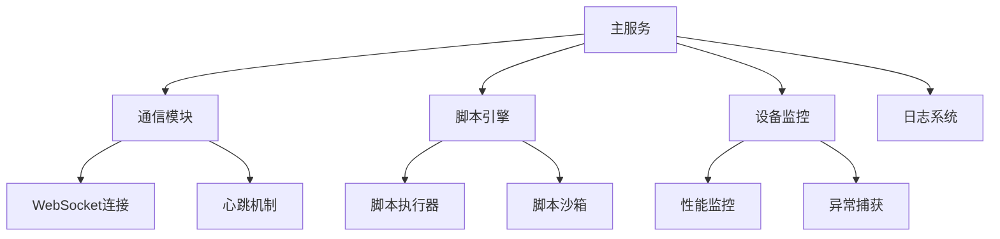

### AutoJS客户端深度实现方案

#### 客户端核心架构


#### 完整客户端实现代码
```javascript
// ========== 设备初始化模块 ==========
const DEVICE_ID = device.getAndroidId();
const SERVER_URL = "wss://your-server.com/ws";
const HEARTBEAT_INTERVAL = 30000; // 30秒心跳
const MAX_RETRY = 5; // 最大重连次数

// 持久化存储
const storage = storages.create("AutoJS_Client");
let authToken = storage.get("auth_token") || null;
let retryCount = 0;

// ========== WebSocket通信模块 ==========
function initWebSocket() {
    try {
        const ws = $websocket.connect(SERVER_URL, {
            headers: {
                "Device-ID": DEVICE_ID,
                "Authorization": authToken ? `Bearer ${authToken}` : ""
            }
        });

        ws.on("open", () => {
            retryCount = 0; // 重置重连计数器
            sendHeartbeat(); // 启动心跳
            deviceLog("WebSocket连接成功");
        });

        ws.on("text", (text) => {
            handleServerMessage(JSON.parse(text));
        });

        ws.on("close", (code, reason) => {
            deviceLog("连接关闭: " + code + "-" + reason);
            scheduleReconnect();
        });

        return ws;
    } catch (e) {
        deviceLog("WS连接异常: " + e);
        scheduleReconnect();
    }
}

// ========== 消息处理器 ==========
function handleServerMessage(msg) {
    switch (msg.type) {
        case "AUTH_REQUIRED":
            handleAuthentication();
            break;
        case "RUN_SCRIPT":
            executeScript(msg.script);
            break;
        case "STOP_SCRIPT":
            terminateScript(msg.scriptId);
            break;
        case "DEVICE_REBOOT":
            rebootDevice();
            break;
        case "HEARTBEAT_ACK":
            // 心跳确认处理
            break;
        case "CONFIG_UPDATE":
            updateDeviceConfig(msg.config);
            break;
        default:
            deviceLog("未知指令: " + msg.type);
    }
}

// ========== 脚本执行引擎 ==========
const runningScripts = new Map();

function executeScript(scriptData) {
    const scriptId = scriptData.id;
    
    // 沙箱环境执行
    const engine = engines.execScript("Script_" + scriptId, 
        `(function() {
            try {
                ${scriptData.content}
            } catch (e) {
                pushLog("SCRIPT_ERROR: " + e);
            }
        })();`,
        {
            arguments: {
                sendLog: (log) => pushLog(log, scriptId)
            }
        }
    );

    // 监听执行状态
    engine.on("exit", () => {
        runningScripts.delete(scriptId);
        pushLog("脚本 " + scriptId + " 已停止", scriptId);
    });

    runningScripts.set(scriptId, engine);
    pushLog("脚本 " + scriptId + " 已启动", scriptId);
}

function terminateScript(scriptId) {
    if (runningScripts.has(scriptId)) {
        runningScripts.get(scriptId).forceStop();
        runningScripts.delete(scriptId);
    }
}

// ========== 设备管理模块 ==========
function handleAuthentication() {
    const deviceInfo = {
        id: DEVICE_ID,
        model: device.model,
        brand: device.brand,
        sdk: device.sdkInt,
        resolution: device.width + "x" + device.height
    };

    $http.post("https://your-server.com/auth/device", deviceInfo, {
        headers: {"Content-Type": "application/json"}
    }).then(res => {
        authToken = res.data.token;
        storage.put("auth_token", authToken);
        deviceLog("设备认证成功");
    }).catch(err => {
        deviceLog("认证失败: " + err);
    });
}

function updateDeviceConfig(config) {
    // 实现配置更新逻辑
    if (config.heartbeatInterval) {
        HEARTBEAT_INTERVAL = config.heartbeatInterval;
    }
}

function rebootDevice() {
    deviceLog("收到重启指令");
    $threads.shutDownAll(); // 停止所有线程
    engines.stopAll();     // 停止所有脚本
    runtime.restart();     // 重启AutoJS服务
}

// ========== 日志系统 ==========
function pushLog(content, scriptId = "SYSTEM") {
    const logEntry = {
        type: "LOG",
        deviceId: DEVICE_ID,
        scriptId: scriptId,
        content: content,
        timestamp: new Date().toISOString()
    };
    
    if (ws && ws.readyState === WebSocket.OPEN) {
        ws.send(JSON.stringify(logEntry));
    }
}

function deviceLog(message) {
    console.log(`[Device] ${message}`);
    pushLog(message);
}

// ========== 心跳机制 ==========
function sendHeartbeat() {
    if (!ws || ws.readyState !== WebSocket.OPEN) return;
    
    ws.send(JSON.stringify({
        type: "HEARTBEAT",
        deviceId: DEVICE_ID,
        battery: device.getBattery(),
        memory: runtime.getMemoryUsage()
    }));
    
    // 定时下一次心跳
    setTimeout(sendHeartbeat, HEARTBEAT_INTERVAL);
}

// ========== 重连机制 ==========
function scheduleReconnect() {
    if (retryCount >= MAX_RETRY) {
        deviceLog("超过最大重连次数，停止尝试");
        return;
    }
    
    const delay = Math.min(30000, 2000 * Math.pow(2, retryCount)); // 指数退避
    retryCount++;
    
    deviceLog(`将在 ${delay/1000} 秒后重连...`);
    setTimeout(() => {
        ws = initWebSocket();
    }, delay);
}

// ========== 主服务入口 ==========
deviceLog("AutoJS客户端启动");
let ws = initWebSocket();

// 注册系统事件监听
events.on("exit", () => {
    deviceLog("服务终止");
    if (ws) ws.close();
});
```

#### 高级功能扩展

1. **脚本热更新系统**
```javascript
function hotReloadScript(scriptId, newContent) {
    if (runningScripts.has(scriptId)) {
        terminateScript(scriptId);
        executeScript({id: scriptId, content: newContent});
    }
}
```

2. **设备资源监控**
```javascript
setInterval(() => {
    const stats = {
        cpu: runtime.getCpuUsage(),
        memory: runtime.getMemoryUsage(),
        battery: device.getBattery(),
        network: $network.getType()
    };
    
    ws.send(JSON.stringify({
        type: "DEVICE_STATS",
        deviceId: DEVICE_ID,
        stats: stats
    }));
}, 60000); // 每分钟上报
```

3. **安全校验模块**
```javascript
function verifyScriptSignature(script) {
    const publicKey = "-----BEGIN PUBLIC KEY-----\n...\n-----END PUBLIC KEY-----";
    const verifier = crypto.createVerify("SHA256");
    verifier.update(script.content);
    
    if (!verifier.verify(publicKey, script.signature, "base64")) {
        throw new Error("脚本签名验证失败");
    }
}
```

#### 性能优化策略

1. **消息压缩传输**
```javascript
ws.send(zlib.deflateSync(JSON.stringify(logEntry)).toString("base64"));
```

2. **本地日志缓存**
```javascript
const logCache = [];

function flushLogCache() {
    if (logCache.length > 0 && ws.readyState === WebSocket.OPEN) {
        ws.send(JSON.stringify(logCache));
        logCache = [];
    }
}

// 每10秒或缓存满50条时发送
setInterval(flushLogCache, 10000);
```

3. **差异化心跳**
```javascript
function dynamicHeartbeat() {
    const interval = device.isScreenOn() ? 30000 : 120000;
    setTimeout(sendHeartbeat, interval);
}
```

#### 异常处理机制

```javascript
// 全局异常捕获
events.on("exception", (err) => {
    pushLog(`CRITICAL_ERROR: ${err}`, "SYSTEM");
});

// 网络异常处理
events.on("network_change", (net) => {
    if (net.available && !ws) {
        deviceLog("网络恢复，尝试重连");
        ws = initWebSocket();
    }
});

// 低电量保护
events.on("battery_low", () => {
    pushLog("电量不足，暂停非关键任务");
    runningScripts.forEach((engine, id) => {
        if (!isCriticalScript(id)) {
            terminateScript(id);
        }
    });
});
```

### 部署与调试建议

1. **设备端部署流程**
```bash
# 构建APK
auto-cli build -o autojs-agent.apk \
  --prefs '{"SERVER_URL":"wss://prod-server.com/ws"}'
```

2. **调试模式启用**
```javascript
// 在设备摇晃时开启调试
sensors.register("shake", () => {
    DEBUG_MODE = !DEBUG_MODE;
    toastLog("调试模式: " + (DEBUG_MODE ? "ON" : "OFF"));
});
```

3. **远程调试接口**
```javascript
app.on("debug_connect", (port) => {
    const debugServer = $net.createServer((socket) => {
        socket.write(JSON.stringify({status: "ready"}));
        // ... 实现调试协议
    }).listen(port);
});
```

该客户端实现方案具有以下特点：
1. **健壮通信机制**：WebSocket连接 + 指数退避重连 + 双重心跳保障
2. **安全执行沙箱**：脚本隔离运行 + 签名验证 + 权限控制
3. **资源智能管理**：动态心跳 + 低电量保护 + 网络感知
4. **全链路监控**：从脚本执行到设备状态的全面监控
5. **高效日志系统**：本地缓存 + 批量上报 + 分级日志

对于生产环境部署，建议：
1. 使用TLS 1.3加密所有通信
2. 添加脚本白名单机制
3. 实现客户端自动更新功能
4. 添加设备地理位置追踪
5. 设置每日执行时间窗口限制
